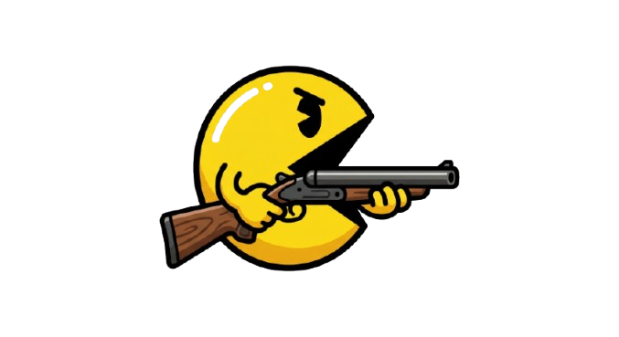

# PacmanDoom.py



Pac-Man search game built with Python and pygame. The game uses a classic 2D board with real-time pathfinding overlays:

- A* calculates a suggested path from the player to the nearest pellet.
- A ghost chases the player using Dijkstra.
- The board can show explored nodes, the frontier, and the decision tree.
- Dots keep their base color and show rings using the color of the enemy that reached them during the search.
- `+` and `-` change the game speed while playing.

## Running

To install dependencies after cloning the repository:

```powershell
.\install.ps1
```

If Windows blocks PowerShell scripts, use:

```powershell
powershell -ExecutionPolicy Bypass -File .\install.ps1
```

Then run the game:

```powershell
.\run_game.ps1
```

The script keeps the cache, the `uv`-managed Python install, and the game's virtual environment inside the project. It uses Python 3.13 to avoid pygame trying to compile on Python 3.14.

If the environment is already prepared, you can also run the module directly:

```powershell
uv run python -m doom_search
```

## Controls

- Arrow keys or `WASD`: move the player.
- `+` or `-`: increase or decrease speed.
- `H`: show or hide the A* suggested path.
- `G`: show or hide the ghost's Dijkstra path.
- `T`: show or hide decision tree lines.
- `Space`: pause or resume.
- `R`: restart.

## Structure

- `doom_search/level.py`: map, walls, pellets, and neighbors.
- `doom_search/algorithms.py`: Dijkstra, BFS, A*, and path reconstruction.
- `doom_search/game_state.py`: game rules and search snapshot.
- `doom_search/animation.py`: smooth movement between grid cells.
- `doom_search/sprites.py`: sprite loading, animation frames, and scale cache.
- `doom_search/renderer.py`: classic board, search overlays, sprites, and HUD.
- `doom_search/pygame_app.py`: pygame event loop and high-level app coordination.
